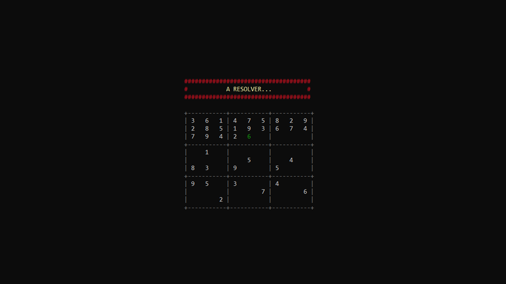

## Sudoku Solver
---
#### Demo :

---

#### Description : 

  * Given any solvable sudoku board, using a backtrack algorithm this program solves it.

  * It can be run in two modes:
    
    * Visualization Mode : Where is displayed every step that the algorithm takes to get to the solution. Its good way to have a basic understanding of how the algorithm works.

    * Instant Mode : Just shows the solution.
   

  * In addition to being able to solve the sudoku, the program also allows a way to input your own sudoku to solve.
  ---